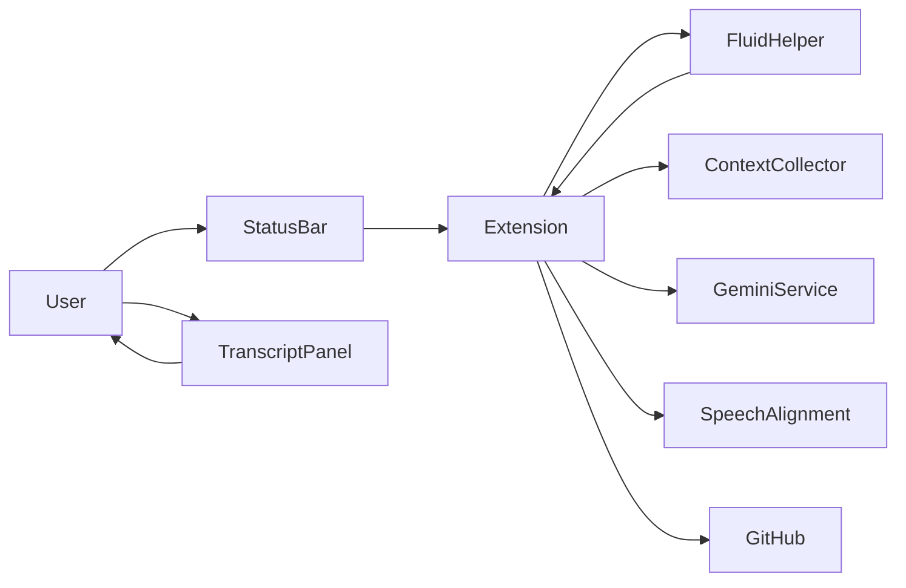
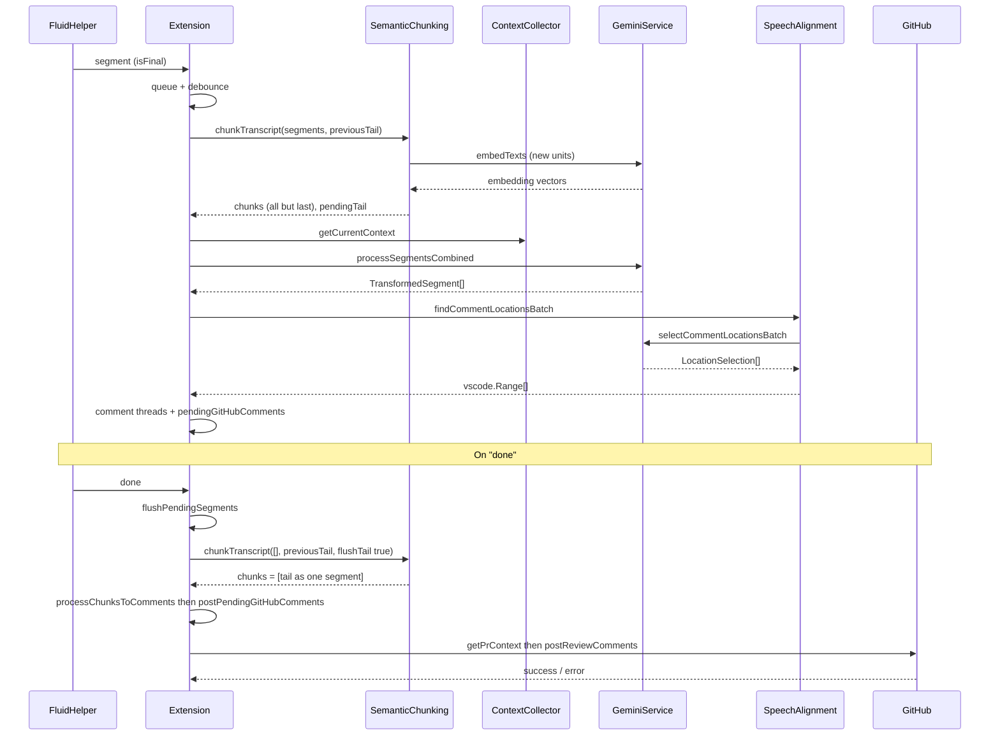

# Data Flow: PR Notes Extension

## 1. Overview

PR Notes records voice during code review, transcribes and diarizes speech via a native helper process (fluid-helper), chunks the transcript by meaning (semantic chunking), classifies and transforms each chunk with the Gemini API, aligns each comment to editor context using timestamps and visible code, and optionally posts them as GitHub PR review comments. Data flows from user actions (status bar, recording) through the Fluid helper (JSON over stdout), the extension’s segment queue, semantic chunking (split → embed → merge), Gemini (classify/transform and location selection), and finally to in-editor comment threads and the GitHub REST API. Each resulting chunk corresponds to one reviewable issue or suggestion and is used to generate one PR comment.

---

## 2. High-level flow

- **User** interacts with the status bar (Record menu) and sees the transcript panel.
- **Extension** ([src/extension.ts](src/extension.ts)) orchestrates: spawns Fluid helper, collects context, processes segments, posts to GitHub.
- **FluidHelper** (native binary) handles audio capture, ASR, and diarization; communicates via JSON lines on stdout/stdin.
- **ContextCollector**, **GeminiService**, **SpeechAlignment**, and **GitHub** (PR context + post comments) are used by the extension as described below.

---

## 3. Activation and UI

- **[src/extension.ts](src/extension.ts)** — `activate()`:
  - Initializes the Gemini service with a secrets getter (`context.secrets` for the API key).
  - Creates a `ContextCollector`, a VS Code comment controller (`pr-notes-comments`), and the `TranscriptPanelProvider` (sidebar webview).
  - Creates the status bar item and sets its command to `pr-notes.showMenu`.
  - `refreshStatusBar()` uses [src/audioDeviceManager.ts](src/audioDeviceManager.ts) for the selected input device and [src/githubAuth.ts](src/githubAuth.ts) for auth state (account label). A session-change listener re-runs `refreshStatusBar()` when GitHub sign-in state changes.

- **Status bar menu** — Command `pr-notes.showMenu` opens a quick pick with:
  - Start/Stop Recording (calls `handleStartRecording` / `handleStopRecording`).
  - Select Input Device (calls `handleSelectDevice`).
  - Sign in with GitHub (calls `handleLogin` when configured).

---

## 4. Recording pipeline

### Start recording

- User chooses **Start Recording** from the status bar menu.
- `handleStartRecording()`:
  1. Calls `contextCollector.startRecording()` to begin collecting editor context.
  2. Calls `startFluidHelper()`: spawns `bin/fluid-helper`, sends `init`; waits for a `ready` message (with optional model-download progress).
  3. Sends `startRecording` with optional `deviceId` (from [src/audioDeviceManager.ts](src/audioDeviceManager.ts)) to the helper’s stdin.
  4. Sets `isRecording = true` and refreshes the status bar.

### Context collection

- **[src/contextCollector.ts](src/contextCollector.ts)** — While recording is active:
  - Subscribes to `onDidChangeActiveTextEditor`, `onDidChangeTextEditorSelection`, and `onDidChangeTextEditorVisibleRanges`.
  - On each event, appends a **RecordingContext** snapshot: `timestamp` (seconds since recording start), `file` (repo-relative path), `cursorLine`, `visibleRange`, and `symbolsInView` (document symbols overlapping the visible range).
  - Snapshots are consumed later by speech alignment to pick the best code location for each comment.

### Fluid helper protocol

- **[src/fluid-helper/Sources/FluidHelper/Protocol.swift](src/fluid-helper/Sources/FluidHelper/Protocol.swift)** defines the JSON message contract.
- Extension reads **stdout** line-by-line (JSON per line) and dispatches in `handleFluidHelperMessage()`:
  - **`volatile`** — Interim transcription text → [src/transcriptPanel.ts](src/transcriptPanel.ts) `updateVolatile(text)`.
  - **`segment`** (with `isFinal: true`) — Final segment with `speakerId`, `text`, `start`, `end` → build a `SpeakerSegment`, add to transcript panel and push to `pendingSegmentsQueue`; debounce (500 ms) then flush.
  - **`speaker`** — Current speaker id → transcript panel `updateCurrentSpeaker(id)`.
  - **`recordingStatus`** — `started` / `stopped` / `error` → transcript panel recording state and status bar; on `started`, clear transcript and reset segment/comment queues.
  - **`done`** — Recording finished; extension flushes pending segments, then posts pending GitHub comments (see below).
  - **`error`** — Show error message to the user.

---

## 5. Segment processing (batch)

- Final segments are queued in **`pendingSegmentsQueue`** and flushed after a **500 ms** debounce ([src/extension.ts](src/extension.ts) `flushPendingSegments`).

- **`processSegmentsBatch(segments)`**:
  1. **Semantic chunking**: Calls [src/semanticChunking.ts](src/semanticChunking.ts) **`chunkTranscript(segments, { previousTail: semanticChunkingTail })`** → **`{ chunks, pendingTail }`**. Segments are split into sentence-level units; the previous batch’s last chunk (pending tail) is prepended so chunks can span batches. Units are embedded via [src/services/gemini.ts](src/services/gemini.ts) `embedTexts` (model `gemini-embedding-001`), and adjacent units with high cosine similarity are merged. All merged chunks **except the last** are returned in `chunks`; the last is kept as **pending tail** for the next batch. Each chunk corresponds to one reviewable issue or suggestion. See [docs/SEMANTIC_CHUNKING.md](SEMANTIC_CHUNKING.md) for design details.
  2. Gets **context** from `contextCollector.getCurrentContext()` and the **active editor** and **current file** (repo-relative path).
  3. Calls [src/services/gemini.ts](src/services/gemini.ts) **`processSegmentsCombined(chunks)`** → **TransformedSegment[]** (classify, split, and transform in one Gemini call). Filters out segments with classification `Ignore` or empty `transformedText` → **toComment**.
  4. Calls [src/speechAlignment.ts](src/speechAlignment.ts) **`findCommentLocationsBatch(toComment, contexts, document, currentFile)`**:
     - For each segment, **findNearestContexts**(segment startTime, contexts, 5, currentFile) → candidate **RecordingContext**s.
     - For each candidate, **extractCodeContext**(context, document) → code snippet; build **CandidateLocation** (timestamp, file, cursorLine, visibleRange, symbolsInView, codeContext).
     - [src/services/gemini.ts](src/services/gemini.ts) **`selectCommentLocationsBatch`**(batchSegments, allCandidates) → **LocationSelection[]** (selectedIndex per segment) → mapped to **vscode.Range[]**.
  5. For each segment: create an in-editor comment thread via the comment controller and append **{ path, line, body }** to **`pendingGitHubComments`**.

---

## 6. After recording stops

- Fluid helper sends **`done`** (with totalSegments, totalSpeakers).
- Extension:
  1. Clears the segment debounce timer, sets `isRecording = false`, refreshes status bar.
  2. **`flushPendingSegments()`** to process any remaining queue (updates semantic chunking tail).
  3. **Flush semantic chunking tail**: If `semanticChunkingTail` is non-null, calls `chunkTranscript([], { previousTail, flushTail: true })` and runs the returned chunk(s) through the pipeline (Gemini, locations, comments), then clears the tail.
  4. **`postPendingGitHubComments()`**:
     - If `postToGitHub` config is false or no session or no PR context, clears `pendingGitHubComments` and returns.
     - [src/githubPrContext.ts](src/githubPrContext.ts) **`getPrContext(accessToken)`** resolves **owner**, **repo**, **pull number**, and **commitId** (from Git API / CLI and optional config overrides).
     - [src/githubPrComments.ts](src/githubPrComments.ts) **`postReviewComments(pendingGitHubComments, prContext, token)`** → GitHub REST API `POST /repos/{owner}/{repo}/pulls/{pull_number}/reviews` with `commit_id`, `event: "COMMENT"`, and the comment bodies/lines/paths.
  5. Clears **`pendingGitHubComments`**.

---

## 7. Key types (reference)

| Type | File | Description |
|------|------|-------------|
| **SpeakerSegment** | [src/types.ts](src/types.ts) | `speakerTag`, `text`, `startTime`, `endTime` |
| **TranscriptUnit** | [src/types.ts](src/types.ts) | One sentence/phrase with `text`, `startTime`, `endTime`, `speakerTag` (used in semantic chunking) |
| **SemanticChunkingTail** | [src/types.ts](src/types.ts) | Pending tail: `units: TranscriptUnit[]`, `embeddings: number[][]` (cross-batch state) |
| **ClassifiedSegment** | [src/types.ts](src/types.ts) | SpeakerSegment + `classification` |
| **TransformedSegment** | [src/types.ts](src/types.ts) | ClassifiedSegment + `transformedText` |
| **CandidateLocation** | [src/types.ts](src/types.ts) | `timestamp`, `file`, `cursorLine`, `visibleRange`, `symbolsInView`, `codeContext` |
| **LocationSelection** | [src/types.ts](src/types.ts) | `selectedIndex`, optional `rationale` |
| **RecordingContext** | [src/contextCollector.ts](src/contextCollector.ts) | Same shape as CandidateLocation input: timestamp, file, cursorLine, visibleRange, symbolsInView |
| **PrContext** | [src/githubPrContext.ts](src/githubPrContext.ts) | `owner`, `repo`, `pullNumber`, `commitId` |
| **ReviewCommentInput** | [src/githubPrComments.ts](src/githubPrComments.ts) | `path`, `line` (1-based), `body` |

---

## 8. From speech to GitHub (sequence)

